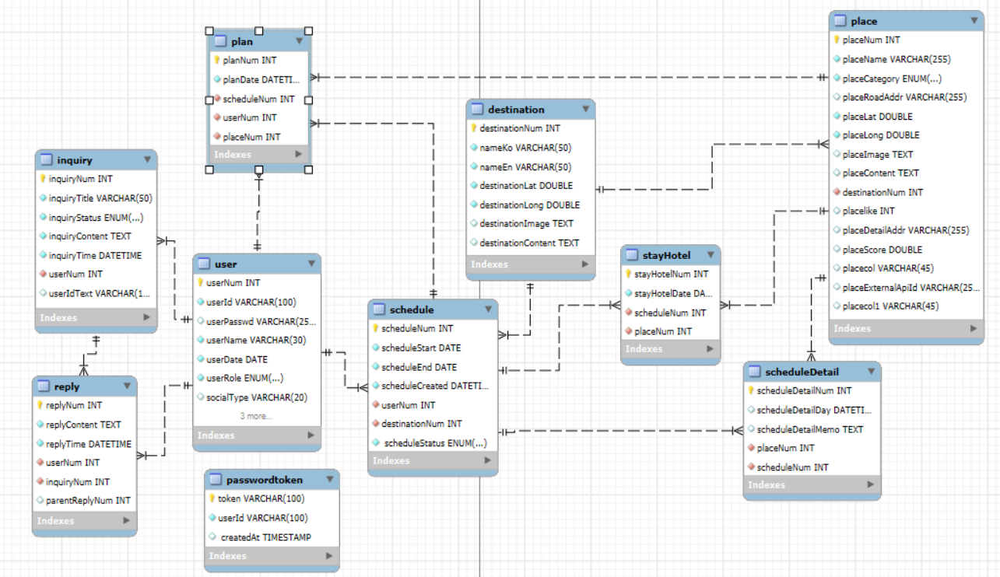

## 📌 프로젝트 이름

On:Trip - AI 여행 일정 생성 서비스

## 1️⃣ 프로젝트 개요

### 📚 소개
이 프로젝트는 여행 일정을 쉽게 계획하지 못 하는 분들을 위해서 AI를 통해서 자동으로 일정을 게획해주는 웹 애플리케이션입니다.

### 🛠️ 기술 스택
<ul>
  <li><b>Frontend</b>
    <ul>
      <li>JavaScript, HTML5, CSS3</li>
    </ul>
  </li>
  <li><b>Backend</b>
    <ul>
      <li>Java (JDK 21), JSP & Servlet, MyBatis, JavaMail</li>
    </ul>
  </li>
  <li><b>Framework / Library</b>
    <ul>
      <li>Spring Boot, Flatpickr, JavaMail</li>
    </ul>
  </li>
  <li><b>API / External Service</b>
    <ul>
      <li>OpenAI API, Kakao Maps API, 행정안전부 공공 API, OAuth</li>
    </ul>
  </li>
  <li><b>Database</b>
    <ul>
      <li>MySQL, ER Diagram</li>
    </ul>
  </li>
  <li><b>Tool / Environment</b>
    <ul>
      <li>Eclipse STS (Spring Tool Suite), MySQL Workbench, Windows 10, WAS (Apache Tomcat 10.1)</li>
    </ul>
  </li>
  <li><b>Collaboration</b>
    <ul>
      <li>GitHub</li>
    </ul>
  </li>
</ul>

### 👥 팀원 및 담당 역할
- **공통 역할**: DB설계, 메인화면, AI 일정 생성
- **이강진**: 
- **박상준**: 
- **류지호**:

## 2️⃣ 설치 및 실행 방법
### 📥 Git clone
  git clone https://github.com/on-trip/ontrip.git
  
  cd ontrip

### ⚙️ 환경설정
1️⃣ MySQL에 ontrip 데이터베이스를 생성합니다.

2️⃣ src/main/resources/application.properties 파일에 DB 접속 정보를 아래와 같이 설정합니다.

    spring.datasource.url=jdbc:mysql://localhost:3306/ontrip

    spring.datasource.username=DB_USERNAME

    spring.datasource.password=DB_PASSWORD

3️⃣ OpenAI API Key, Kakao API Key 등 외부 서비스 키를 application.properties에 추가합니다.

    openai.api.key=YOUR_OPENAI_API_KEY 

    kakao.api.key=YOUR_KAKAO_API_KEY

### ▶️ 빌드 및 실행
아래 명령어로 애플리케이션을 빌드하고 실행합니다.

  gradlew build

  gradlew bootRun

✅ 실행 후 웹 브라우저에서 http://localhost:8080에 접속해 서비스를 확인하세요.

### 3️⃣ 주요 기능 및 화면
### ✨ 주요 기능
- AI 기반 일정 자동 생성
- 여행 기간 선택 및 캘린더 UI
- 장소 및 숙소 선택 (카카오 지도 연동)
- 여행 일정 저장 및 시각화

### 🖥️ 화면 캡처
#### 🗓 메인 화면
- AI 여행 일정 생성 시작 화면으로, 여행 지역과 기간을 입력할 수 있음

#### 📅 날짜 선택(캘린더) 화면
- 캘린더로 여행 날짜를 선택하고 일정 기간을 설정할 수 있음

#### 🗺️ 지역·날짜 확인 화면
- 앞에서 선택한 여행 지역과 날짜를 한눈에 확인 가능

#### 📍 명소·식당·카페 선택 화면
- 명소, 식당, 카페를 선택하고 지도에서 위치를 한눈에 확인 가능

#### 🏨 숙소 선택 화면
- 여행 날짜별로 숙소를 선택하고 지도에서 위치 확인 가능

#### 🗂 일정 상세 화면
- 선택한 일정과 명소, 식당, 카페, 숙소 등을 확인할 수 있음

#### ✅ AI 생성 일정 확인 화면
- AI가 생성한 여행 계획을 날짜별로 확인하고, 각 일차별 동선도 지도에서 시각적으로 확인 가능

## 4️⃣ DB 설계 및 API 정보
### 🗂️ ERD 이미지

#### 🧩 테이블 설명

## 5️⃣ 업데이트 및 버전 관리 (선택
