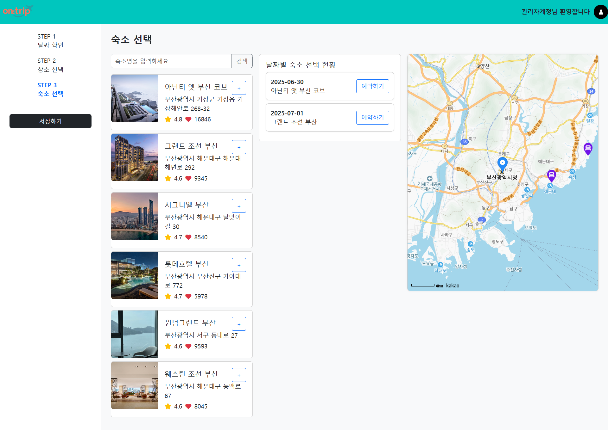
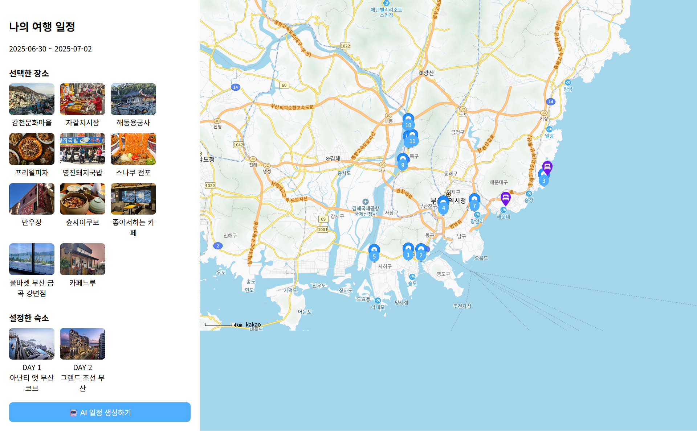
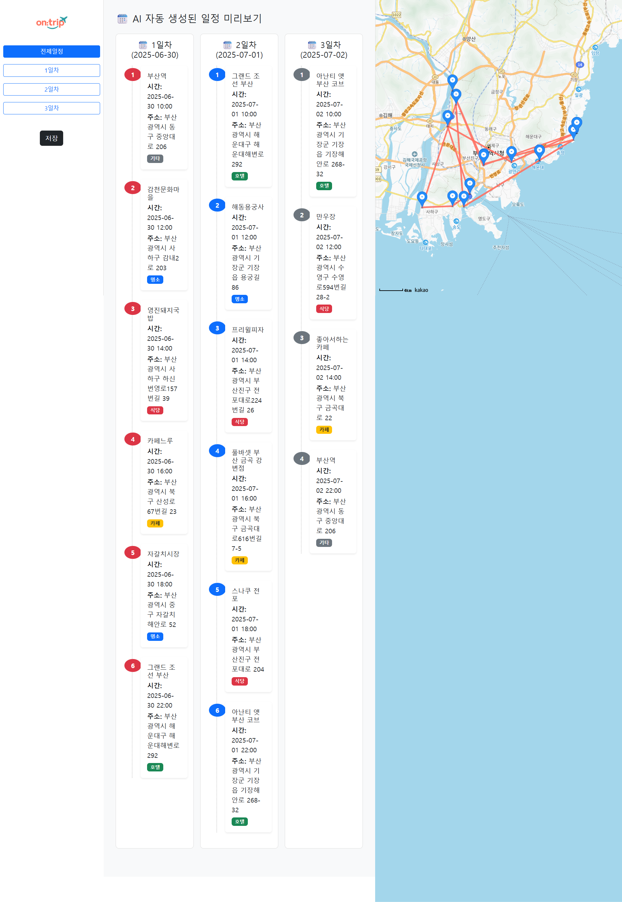

# 📌 프로젝트 이름

팀 프로젝트 - On:trip

## 📚 프로젝트 소개
이 프로젝트는 여행 일정을 쉽게 계획하지 못 하는 분들을 위해서 AI를 통해서 자동으로 일정을 게획해주는 웹 애플리케이션입니다.

## 🛠️ 주요 기능
- 
-
-

## 👥 팀원 및 담당 역할
- **공통 역할**: DB설계, 메인화면,
- **이강진**: 
- **박상준**: 
- **류지호**:

## 📸 화면
### 🗓 메인 화면
- AI 여행 일정 생성 시작 화면으로, 여행 지역과 기간을 입력할 수 있음

### 📅 날짜 선택(캘린더) 화면
- 캘린더로 여행 날짜를 선택하고 일정 기간을 설정할 수 있음

### 📍 명소·식당·카페 선택 화면
- 명소, 식당, 카페를 선택하고 지도에서 위치를 한눈에 확인 가능

### 🏨 숙소 선택 화면
- 여행 날짜별로 숙소를 선택하고 지도에서 위치 확인 가능

### 🗂 일정 상세 화면
- AI가 추천한 일정과 각 날짜별 동선, 명소, 숙소 등을 확인할 수 있음

### ✅ AI 생성 일정 확인 화면
- AI가 생성한 여행 계획을 날짜별로 확인하고, 각 일차별 동선도 지도에서 시각적으로 확인 가능

## ⚙️ 설치 및 실행 방법
1.
