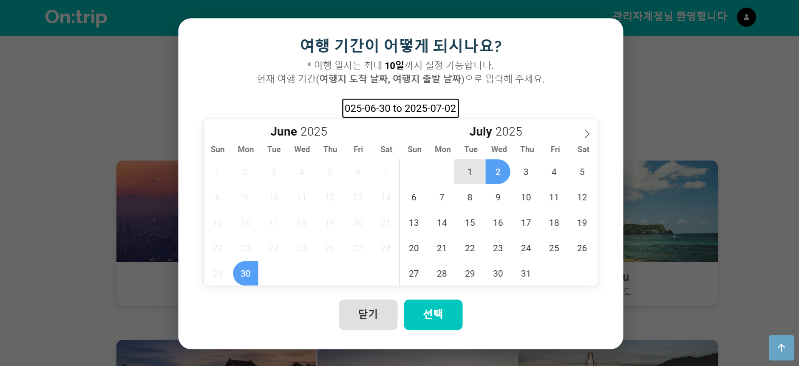
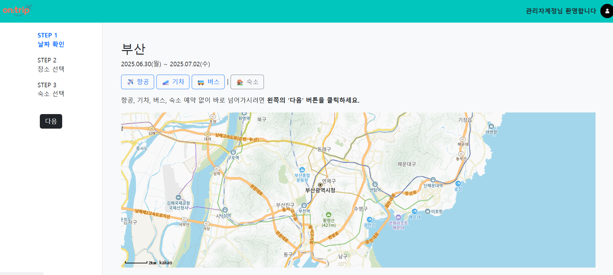
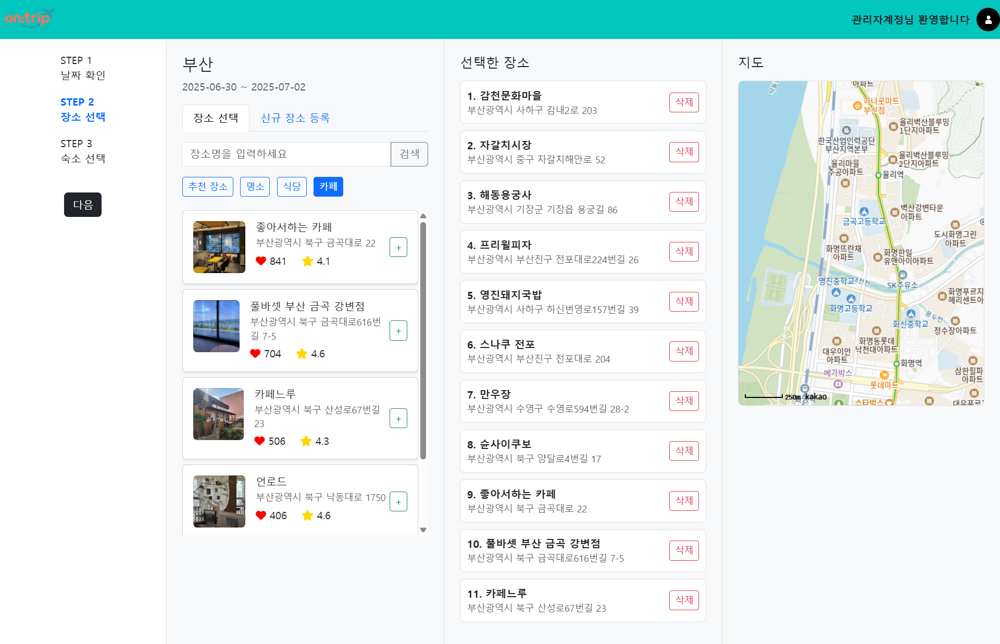

# 📌 프로젝트 이름

팀 프로젝트 - On:trip

## 📚 프로젝트 소개
이 프로젝트는 여행 일정을 쉽게 계획하지 못 하는 분들을 위해서 AI를 통해서 자동으로 일정을 게획해주는 웹 애플리케이션입니다.

## 🛠️ 주요 기능
- 
-
-

## 👥 팀원 및 담당 역할
- **공통 역할**: DB설계, 메인화면,
- **이강진**: 
- **박상준**: 
- **류지호**:

## 📸 화면

## ⚙️ 설치 및 실행 방법
1.
